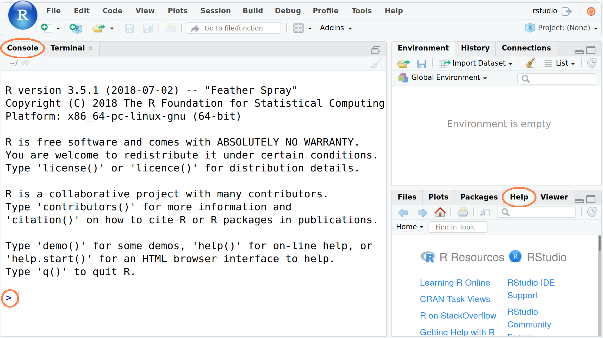

```{r setup, include=FALSE}
knitr::opts_chunk$set(echo = TRUE, 
                      eval = TRUE,
                      cache = FALSE,
                      fig.pos = 'H') #, knitr.table.format = 'latex')
library(data.table)
library(ggplot2)
library(knitr)
library(kableExtra)
options(width=50)

# Making some aesthetic changes for this document
theme_set(theme_gray(base_size = 9))
update_geom_defaults("point", list(size = 0.5))
update_geom_defaults("boxplot", list(outlier.size = 0.5))

# Temporarily resetting the print limit
op <- options()
options(datatable.print.topn=3, width=50)
```

# Prólogo

Esta guía de "Introducción" es una breve aproximación de lo que se puede hacer con R[^baseR]. Para aprovecharla al máximo es conveniente su lectura y a la vez, ir haciendo los ejemplos y los ejercicios que aquí se presentan usando RStudio[^rstudio].  

Esta guía es una variante original del documento[^gettingstarted] pero hace hincapié en el uso de Base R junto con una gestión cuidadosa de las dependencias como se explica a continuación.

## Experimentar en Modo Seguro

Lo ideal es experimentar con comandos y opciones, ya que es una parte esencial del proceso de aprendizaje. Las cosas pueden salir "mal" (lo harán), como recibir mensajes de error o eliminar cosas que se hayan creado, pero la mayoría de las situaciones pueden recuperarse (por ejemplo, reiniciando R). Para hacer esto "de forma segura", comienza con una sesión en R *nueva* sin ningún otro dato cargado.

# Introducción

## Antes de Comenzar

Es conveniente asegurarse de que:

1. R y RStudio (por ese orden) están instalados.
2. Comprobar que estamos en el directorio de trabajo deseado con `getwd()`. 

## Comenzando R y RStudio

R arranca automáticamente cuando se abre RStudio (ver Fig. \ref{fig:rstudio}). La consola comienza con información sobre el número de versión, la licencia y los colaboradores. La última línea es un mensaje estándar "`>`" que indica que R está listo y esperando instrucciones para hacer algo.
```{r RStudioScreenshot, out.width="3.4in", fig.show='hold', fig.cap="\\label{fig:rstudio}Captura de pantalla de RStudio con la consola a la izquierda y la pestaña Ayuda en la parte inferior derecha", echo=FALSE}

```

## Saliendo de R y RStudio

Se nos preguntará si deseamos `Guardar espacio de trabajo (Save workspace)` con dos opciones:

* "Yes" -- Nuestro espacio de trabajo actual de R (que contiene el trabajo que hemos realizado) será restaurado la próxima vez que se abra RStudio.
* "No" -- Comenzaremos con una nueva sesión de R la próxima vez que abramos RStudio. Por ahora, seleccionaremos "*No*" para evitar errores de sesiones anteriores.

# La Ayuda (Help) en R

RStudio tiene un extenso sistema de ayuda incorporado que suele ser muy útil a la hora de encontrar soluciones a cualquier problema ya sea con comandos, paquetes y/o funciones.

## Función `help()`

Desde la "consola" de R se puede usar la función `help()` o `?`. Por ejemplo, los dos comandos siguientes proporcionan el mismo resultado:
```{r helpttest, echo=TRUE, eval=FALSE}
help(mean)
?mean
```

## Búsqueda de palabra clave.

Para buscar una palabra clave se usa la función `apropos()` con la palabra en cuestión entre comillas doble (`"keyword"`) o comillas simple (`'keyword'`). Por ejemplo:
```{r aproposShow, echo=TRUE, eval=TRUE}
apropos("mean")
```

## Ejemplos de Ayuda

Use la función `example()` para ejecutar los ejemplos al final de la ayuda para una función:
```{r egttest, echo=2}
options(prompt="> ")
example(mean)
options(prompt="R> ")
```

## La Ayuda de RStudio 

Rstudio proporciona un cuadro de búsqueda en la pestaña "Ayuda" para hacer el trabajo más fácil (ver Fig. \ref{fig:rstudio}). 


## Búsqueda de ayuda para R on-line

Hay muchos recursos on-line que pueden servir de ayuda, sin embargo, copiar y pegar sin más, a veces, no será de mucha ayuda y ralentizará el proceso de aprendizaje y desarrollo. Cuando se haga una búsqueda on-line use `[R]` en el término de búsqueda, (p. ej. "[R] resumen estadísticos por grupo"). A menudo hay más de una solución para un problema en R, por lo que es bueno investigar las diferentes opciones.

## Ejercicio

Intente lo siguiente: 

1. `help(median)`
2. `?sd`
3. `?max`

## Advertencia

Si un comando R no está completo, R mostrará un signo más (`+`) en la segunda línea y en las siguientes hasta que la sintaxis del comando sea correcta.
```{r continuation, echo=TRUE, eval=FALSE}
+
```
Para cortar esto, presione la tecla de escape (`ESC`).

## Truco

Para recuperar un comando escrito anteriormente, use la tecla de flecha hacia arriba ($\uparrow$). Para ir entre los comandos escritos anteriormente, use las flechas ($\uparrow$) y ($\downarrow$). Para modificar o corregir un comando use la flecha izquierda ($\leftarrow$) y la derecha ($\rightarrow$).

# Algunos conceptos en R

En lenguaje R, escalares, vectores/variables y datasets se denominan ***objetos***. Para crear objetos (cosas) hay que usar el operador asignación `<-`. Por ejemplo, a continuación, al objeto `altura` se le ha asignado el valor 173 (tecleando `altura` se muestra su valor):
```{r createObjs}
altura <- 173
altura
```

## Advertencia: sobre las mayúsculas

`edad` y `EdaD` son diferentes:
```{r caseSens1}
edad <- 10
EdaD <- 50
```

```{r caseSens2}
edad
EdaD
```

## Nuevas líneas

Los comandos en R suelen estar separados por una nueva línea, pero también pueden estarlo por un punto y coma `;`. 
```{r semicolon}
Nombre <- "Juan"; Edad <- 20; Ciudad <- "Madrid"
Nombre; Edad; Ciudad
```

## Comentarios

Es útil incluir comentarios explicativos en el código los cuales suelen ser de ayuda cuando se retome el script. Los comentarios en R comienzan por el símbolo almohadilla (`#`). Todo lo que esté después de este símbolo hasta el final de la línea será ignorado por R.
```{r comments}
# Este comentario será ignorado cuando se ejecute.
Ciudad     # El texto despues de "#" es ignorado.
```

# R como calculadora

Es posible usar R como calculadora. Pruebe lo siguiente:
```{r calcBasic}
2 + 3           
(5*11)/4 - 7     
# ^ = "potencia de un número"
7^3 
```

## Otras funciones matemáticas

También se pueden utilizar funciones matemáticas estándar que normalmente se encuentran en una calculadora científica.

* Trigonométricas: `sin()`, `cos()`, `tan()`, `acos()`, `asin()`, `atan()` 
* Redondeo: `abs()`, `ceiling()`, `floor()`, `round()`, `sign()`, `signif()`, `sqrt()`, 
`trunc()`
* Logarítmicas y Exponenciales: `exp()`, `log()`, `log10()`, `log2()`
 
```{r calcFunctions}
# Raíz cuadrada
sqrt(2)          
# Redondeo a la baja al entero más cercano
floor(8.6178)
# Redondeo a dos decimales
round(8.6178, 2)
```

## Ejercicio

Compruebe qué hacen los siguientes pares de comandos:

1. `ceiling(18.33)` y `signif(9488, 2)`
2. `exp(1)` y `log10(1000)`
3. `sign(-2.9)` y `sign(32)` 
4. `abs(-27.9)` y `abs(11.9)`

# Algunos conceptos adicionales en R

Se pueden hacer algunas cosas útiles e interesantes con el operador de asignación  "`<-`": 
```{r assignBasic}
longitud <- 7.8
anchura <- 6.4
area <- longitud * anchura
area
```

## Objetos de texto

También podemos asignar un texto a un objeto.
```{r assignText}
saludo <- "Hola Mundo!"
saludo
```

## Vectores

Los objetos presentados hasta ahora han sido todos escalares (valores únicos). Trabajar con vectores es donde R brilla mejor, ya que son los componentes básicos de los conjuntos de datos. Para crear un vector podemos usar la función `c()` (combinar valores en un vector).
```{r cVector}
# Un vector "numérico"
x1 <- c(26, 10, 4, 7, 41, 19)
x1
# Un vector caracter de nombres de países
x2 <- c("Brasil", "Italia", "Cuba", "Ghana")  
x2
```

Hay otras muchas formas de crear vectores, por ejemplo, `rep()` (replicate elements) y `seq()` (create sequences):
```{r repseq}
# Repetir el vector (2, 6, 7, 4) tres  veces
r1 <- rep(c(2, 6, 7, 4), times=3)
r1
# Vector desde -2 a 3 incrementado en 0.5
s1 <- seq(from=-2, to=3, by=0.5)
s1
```

## Operaciones con vectores

También se pueden realizar cálculos con vectores, por ejemplo, usando el vector `x1` creado antes:
```{r operationsVecs}
x1 * 2
round(sqrt(x1*2.6), 2)
```

## Valores perdidos

En R, los valores perdidos son codificados como `NA`. Por ejemplo,
```{r MissingValues}
x2 <- c(3, -7, NA, 5, 1, 1) 
x2
x3 <- c("Rata", NA, "Raton", "Hamster")
x3
```

## Manejando Objetos

El uso de la función `ls()` permite listar los objetos de nuestro espacio de trabajo. La función `rm()` los elimina (borra).
```{r lsrm}
ls()
rm(x1, x2, x3, r1, s1, EdaD, edad)
ls()
```

## Ejercicio

Calcular la cantidad `bruta` añadiendo la `tasa` al `neto`.
```
  neto <- c(108.99, 291.42, 16.28, 62.29, 31.77)
  tasa <- c(22.89, 17.49, 0.98, 13.08, 6.67)
```

# R Funciones y paquetes

## R Funciones

Ya hemos usado algunas funciones en R (p. ej.:  `c()`, `mean()`, `rep()`, `sqrt()`, `round()`). La mayoría de los cálculos en R implican el uso de funciones. Una función tiene esencialmente un nombre y una lista de argumentos separados por una coma. Por ejemplo:
```{r functionUsage}
seq(from = 5, to = 8, by = 0.4)
```
El nombre de la función es `seq` y tiene 3 argumentos: `from`, `to` y `by`. Los argumentos `from` y `to` son los valores de comienzo y final de la secuencia que se quieren crear y `by` es el incremento de la secuencia. Las funciones `seq()` tienen otros argumentos los cuales están recogidos en la ayuda. Por ejemplo, podemos usar el argumento `length.out` (en vez de `by`) para fijar la longitud de la secuencia, por ejemplo:
```{r functionAlt}
seq(from = 5, to = 8, length.out = 16)
```

## Funciones personalizadas

Podemos crear nuestras propias funciones (usando la palabra clave `function ()`) y así aprovechar la potencia de las funcionalidades de R. Crear funciones propias no es el objetivo del curso aunque a medida que uno se familiarice más con R, es probable que se necesite aprender a hacerl.

## Paquetes en R

Con una instalación estándar de R se pueden hacer bastantes cosas pero puede ampliarse utilizando paquetes contribuidos. Los paquetes son como aplicaciones para R, creados por cualquier usuario y pueden contener funciones, datos y documentación.

## Base Extensible R

Base R ya viene con más de dos mil funciones versátiles, fiables y estables, lo cual ya es bastante. El código de buenas prácticas de programación en R pasa por resolver un problema con _menos_ dependencias externas, por lo que siempre será conveniente pensar detenidamente antes de agregar cualquier tipo de dependencia.

## El Universo `tidyverse`

La filosofía de _menos es más_ está en el núcleo de tidyverse[^tidyverse]. Menos dependencias en los paquetes, una instalación más rápida y, aún más importante, menos nodos en el esquema de dependencia.

Por lo tanto, elegir los paquetes adicionales tiene que equilibrarse con la funcionalidad que nos aporta ese paquete con su historial y modelo de desarrollo, el estado de mantenimiento y el historial de cambios y correcciones. Este _es_ un tema complejo, pero al agregar otro paquete, siempre abrimos una puerta a cambios de interfaz que ya no controlamos. La funcionalidad agregada es útil a veces, sin embargo, hay que ser consciente de los costes que pueden acumularse como consecuencia. Por lo tanto, la filosofía del curso se basa en que _menos es mejor_ y veremos, entre otros, dos paquetes adicionales: `data.table` [^datatable] para la distribución de datos, así como para la entrada/salida, y `ggplot2` [^ggplot2] para la visualización.

## Instalación

Si es necesario, instale estos dos paquetes a través del siguiente comando que debería elegir la versión adecuada para su instalación:
```{r installation, eval=FALSE}
install.packages(c("data.table", "ggplot2"))
```

# El Dataset `Chick Weight`

R viene con muchos datasets instalados[^Rdatasets]. Usaremos el dataset llamado `ChickWeight` para aprender a manipular datos. El sistema de ayuda ofrece un resumen básico del experimento del que se recopilaron los datos:

> *"Los pesos corporales de los polluelos se midieron al nacer y cada dos días, a partir de entonces,
hasta el día 20. También se midieron el día 21. Había cuatro grupos de polluelos con diferentes dietas proteicas."*

Se puede obtener más información, incluidas las referencias, escribiendo:
```{r helpCWdata, echo=TRUE, eval=FALSE}
help("ChickWeight")
```

## Los Datos

Hay `r nrow(ChickWeight)` observaciones (filas) y `r ncol(ChickWeight)` variables:

* `Chick` -- identificación única para cada polluelo. 
* `Diet` -- una de las cuatro dietas proteicas.
* `Time` --  número de días desde el nacimiento. 
* `weight` -- peso corporal del polluelo en gramos (recuerde que empieza por minúscula y R es sensible a las mayúsculas).

## Objetivo

Investigar el *efecto de la dieta sobre el peso en el tiempo*.

# Importando los datos

```{r writeCW, echo=FALSE, message=FALSE, warning=FALSE, eval=TRUE}
## data.table already loaded above
CW <- data.table(ChickWeight)
if (!file.exists("ChickWeight.csv"))
    fwrite(CW[, .(Chick, Diet, Time, weight)],
           file="ChickWeight.csv")
```

Primero importaremos los datos de un archivo llamado `ChickWeight.csv` usando la función `fread()` del paquete `data.table` que devuelve un objeto `data.table` (mientras que el conjunto de datos integrado en R tiene un formato diferente). Lo primero que se debe hacer, fuera de R, es abrir el archivo `ChickWeight.csv` para verificar qué contiene y si tiene sentido. Ahora podemos importar los datos como sigue:

```{r cwdt}
suppressMessages(library(data.table))  # tinyverse
cw <- fread("ChickWeight.csv")
```

## Nota                     

Si funciona, los datos ahora se almacenan en un objeto R llamado `cw`. Si aparece el siguiente mensaje de error, se debe cambiar el directorio de trabajo donde se almacenan los datos. 

```
Error: 'ChickWeight.csv' does not exist in current
working directory ...
```

## Cambio del directorio de trabajo en Rstudio

En la barra de menú, seleccione "Session - Set Working Directory - Choose Directory..." y luego vaya al directorio donde se almacenan los datos. Alternativamente, dentro de R, puede usar la función `setwd()`[^setwd]. También puede especificar una ruta completa, usando `~` para indicar su directorio de inicio. 

# Mirando el Dataset

Para ver los datos, escriba el nombre del objeto (dataset):

```{r printcw}
cw
```

Varias funciones en base R nos ayudan a inspeccionar los datos: `str()` muestra la estructura de forma compacta, `summary()` nos da un resumen y `head()` y `tail()` muestran el comienzo y el final del conjunto de datos.

```{r cwsummaryActual, echo=3:4, eval=TRUE, result="asis"}
str <- function(object, ...) {
    if (!is.data.frame(object)) {
        warning("str.data.frame() called with non-data.frame -- coercing to one.")
        object <- data.frame(object)
    }
    cl <- oldClass(object)
    cl <- cl[cl != "data.frame"]
    if (0 < length(cl)) 
        cat("Classes", paste(sQuote(cl), collapse = ", "), "and ")
    cat("'data.frame':\n  ", nrow(object), " obs. of  ", (p <- length(object)), 
        " variable", if (p != 1) "s", if (p > 0) ":", "\n", sep = "")
  #if (length(l <- list(...)) && any("give.length" == names(l))) 
  #  invisible(NextMethod("str", ...))
  #else invisible(NextMethod("str", give.length = FALSE, ...))
  utils:::str.default(object, vec.len=2, strict.width="wrap", ...)
}
options(digits=5,width=45)
str(cw)
summary(cw)
options(digits=6,width=50)
```

## Interpretación
Esto muestra que el conjunto de datos tiene `r nrow(cw)` observaciones y `r ncol(cw)` variables como cabría esperar, y en comparación con el archivo de datos original `ChickWeight.csv`. La función `str()` nos dice los tipos de variables (todos `integer`, es decir, números) y los primeros valores.  El panel 'Environment' de RStudio ofrece una vista muy similar.

## Ejercicio
Es importante mirar las últimas observaciones del conjunto de datos, ya que podría revelar posibles problemas con los mismos. Use la función `tail()` para hacerlo. ¿Es consistente con el archivo original `ChickWeight.csv`?

# Chick Weight: Visualización de los Datos

## El Paquete `ggplot2`

Para visualizar los datos del peso de los polluelos, usaremos el paquete `ggplot2`. Nuestro interés está en ver cómo el *peso de los polluelos cambia con el tiempo por la dieta*. Por el momento solo intentaremos entender y comprender el funcionamiento. Para obtener más información, es bueno intentar cosas diferentes incluso si se recibe un mensaje de error.

## Primer gráfico

Hagamos el gráfico del peso (eje vertical) sobre el tiempo (eje horizontal).
```{r emptyPlot, fig.width=1.74, fig.height=1.74, fig.show='hold', fig.align='center'}
# Carga del paquete de gráficos
suppressMessages(library(ggplot2))
# Gráfico vacío (the plot on the left)
ggplot(cw, aes(Time, weight))  
# WCon los datos (the plot on the right)
ggplot(cw, aes(Time, weight)) + geom_point() 
```

## Ejercicio

Cambie las variables `Time` y `weight` en el código usado para el gráfico de la derecha. ¿Qué opinas de este nuevo gráfico comparado con el original?

## Añadir color a la variable `Diet`

El gráfico de arriba no diferencia entre las diferentes dietas. Vamos a usar un color diferente para cada una.
```{r addColourPlot, fig.height=2.0}
# Añadiendo color a la variale dieta
ggplot(cw, aes(Time,weight,colour=factor(Diet))) +
  geom_point() 
```

## Interpretación

Es difícil concluir algo a partir del gráfico anterior, ya que los puntos están impresos uno encima del otro (con la dieta 1 debajo y la dieta 4 en la parte superior).

## Variables en Factor

Antes de continuar, tenemos que hacer un cambio importante en el conjunto de datos `cw` transformando las variables `Diet` y `Time` en *factores*. Esto significa que R los tratará como variables categóricas en lugar de variables continuas, lo que simplificará nuestra programación.

```{r cwfactor, echo=2:4, result="asis"}
options(digits=5,width=45)
cw[, Diet := factor(Diet)]  
cw[, Time := factor(Time)]
str(cw)     # nótese la diferencia
options(digits=6,width=50)
```

Obsérvese que el operador `:=` ha modificado la variable "in-situ", no realizando ninguna asignación explícita. Esta es una característica clave del comando `data.table` el cual operaba "por referencia": los cambios se realizan en referencia a una instancia de la variable `cw`, en lugar de crear copias actualizadas.

## Función `facet_wrap()` 
Para dibujar cada dieta por separado en una cuadrícula usando `facet_wrap()`:

```{r jitterPlot}
# Añadiendo la opción jitter a los puntos
ggplot(cw, aes(Time, weight, colour=Diet)) +
  geom_point() +
  facet_wrap(~ Diet) +
  theme(legend.position = "bottom")
```

## Exercise
Para superar el problema de los puntos superpuestos podemos usar la opción ***jitter*** con el comando `geom_jitter()`. Sustituya `geom_point()` con `geom_jitter()`. ¿Qué se puede observar?

## Interpretación

Aunque la dieta 4 tiene la menor variabilidad y la dieta 3 la variabilidad más alta, realmente no podemos decir nada sobre el efecto medio de cada dieta.

## Ejercicio 

Para la posición de la leyenda `legend.position`, trate de usar "top", "left" y "none". ¿Realmente necesitamos una leyenda para este gráfico?

## Gráfico de linea media

Trazamos los cambios medios a lo largo del tiempo para cada dieta usando la función `stat_summary()`:
```{r meanlinesPlot, fig.height=2.0}
ggplot(cw, aes(Time, weight, 
               group=Diet, colour=Diet)) +
  stat_summary(fun="mean", geom="line") 
```

## Interpretación

Podemos ver que la dieta 3 tiene el aumento de peso medio más alto al final del experimento, pero no tenemos ninguna información sobre la variación (incertidumbre) en los datos.

## Ejercicio

¿Qué ocurre cuando se añade el comando `geom_point()` al gráfico? No olvide el símbolo `+`. ¿Hay alguna diferencia si se coloca antes o después de la línea `stat_summary (...)` ? Sugerencia: observe con mucho cuidado cómo se traza la gráfica.

## Diagrama de cajas (Box-plot)

Para ver la variación entre las diferentes dietas usamos `geom_boxplot` para trazar un diagrama de caja.

```{r boxPlot}
ggplot(cw, aes(Time, weight, colour=Diet)) +
  facet_wrap(~ Diet) +
  geom_boxplot() +
  theme(legend.position = "none") +
  ggtitle("Peso del ave sobre el tiempo y dieta")
```

## Interpretación

La dieta 3 parece tener el aumento de peso "medio" más alto, pero tiene más variación que la dieta 4, lo cual es consistente con nuestros hallazgos hasta ahora. 

## Ejercicio

Añada la siguiente información al gráfico anterior:

* etiqueta eje-x (use `xlab()`): "Tiempo (días)"
* etiqueta eje-y (use `ylab()`): "Peso (gramos)"

## Final Plot 

Terminemos con un gráfico que se podría incluir en cualquier presentación
```{r finalPlot}
ggplot(cw, aes(Time, weight, group=Diet, 
                             colour=Diet)) +
  facet_wrap(~ Diet) +
  geom_jitter() +
  stat_summary(fun.y="mean", geom="line",
               colour="black") +
  theme(legend.position = "none") +
  ggtitle("Peso del ave sobre el tiempo y dieta") + 
  xlab("Tiempo (días)") +
  ylab("Peso (gramos)")

```

# Conceptos básicos de la gestión de datos `data.table`

En esta sección aprenderemos cómo manipular conjuntos de datos usando el paquete `data.table`. Conceptualmente, las operaciones con `data.table` pueden verse como `dt[i, j, by]` con alguna similitud intencional con SQL. Aquí `i` puede seleccionar filas (o ubconjuntos), `j` se usa para seleccionar, resumir o mutar columnas, y `by` es el operador de agrupación. A continuación se muestran varios ejemplos.

## `j` para seleccionar (o transformar) columnas

Esta opción agrega una nueva variable (columna) o modifica una existente. Ya usamos esto anteriormente para crear variables de factor.

```{r dtmutate}
cw[, weightKg := weight/1000]   # añade una columna
cw
cw[, Diet := paste0("Diet_", Diet)] # la modifica
cw
```

## `j` para seleccionar (o transformar) columnas

Mantiene, suelta o reordena las variables

```{r dtselect}
# Mantener las variables Time, Diet y weightKg
cw[, .(Chick, Time, Diet, weightKg)]
```

## `j` para resumir

Se puede utilizar para agregar, lo que resulta especialmente útil con el operador de agrupación. El siguiente ejemplo calcula las medias y las desviaciones estándar de la variable peso 'weight' agrupada por dieta 'Diet'. Tenga en cuenta que la salida se ha truncado.

```{r condmean, echo=3}
dt.print.nrows=getOption("datatable.print.nrows")
options(datatable.print.nrows=8)
cw[, .(Mean = mean(weight),SDev = sd(weight)),
   by=.(Diet, Time)]
options(datatable.print.nrows=dt.print.nrows)
```

## `setnames()` para nombrar o renombrar

Cambia el nombre de las variables manteniendo el resto.

```{r dtrename}
setnames(cw, c("Diet", "weight"),
         c("Group", "Weight"))
cw
```

## Operador `i`

Mantiene o quita observaciones (filas).

```{r dtfilter}
cw[Time == 21 & Weight > 300]
```

Para comparar valores en vectores, se usa: `<` (menor que), `>` (mayor que), `<=` (menor o igual que), `>=` (mayor o igual que), `==` (igual a) y `!=` (diferente a). Estos se pueden combinar lógicamente usando `&` (y) y `|` (o).

## Clave de observaciones

La configuración de una clave cambia el orden de las observaciones (filas) y también hace que la indexación sea más rápida.

```{r dtarrange}
cw[order(Weight)]       # sobre la marcha
setkey(cw, Chick, Time)  # establece una clave
cw
```
## Ejercicio

¿Qué hace el comando `order()`? Pruebe `order(Time)` y `order(-Time)` en la columna `i`. 

# Encadenamiento 

Es posible que queramos realizar varios pasos de gestión de datos a la vez. Aquí es donde el 'encadenamiento' de las operaciones con `data.table` (es decir, varios conjuntos de comandos con corchetes) es de gran ayuda:

```{r cwchained}
cw21 <- cw[Time %in% c(0,21)][  # i: selección filas
  , weight := Weight][          # j: mutar
  , Group := factor(Group)][
  , .(Chick,Group,Time,weight)][  # j: arreglar
   order(Chick,Time)][            # i: ordenar
  1:5]                            # i: agrupar
```

# Chick Weight: Resumen de Estadísticos

De las visualizaciones de datos anteriores concluimos que la dieta 3 tiene la media más alta y la dieta 4 la menor variación. En esta sección, cuantificaremos los efectos de las dietas utilizando estadísticas resumidas. Comenzamos mirando el número de observaciones y la media del peso agrupados por **dieta** y **tiempo**.

```{r ctstats}
cw[, .(N  = .N,         # .N es el número por grupo
  Mean = mean(Weight)), # calcula la media
  by=.(Group, Time)][   # agrupado por Diet + Time
  1:5]                  # muestra las filas 1 a 5
```

## Argumento `by=`

Para cada combinación distinta de `Dieta` y `Tiempo`, los datos de peso del polluelo se resumen en el número de observaciones (`N`, utilizando la variable interna `.N` que indica el tamaño actual del grupo) y la media (`Mean`) del peso (`Weight`).

## Otros resúmenes

Podemos calcular la desviación estándar, la mediana, los valores mínimo y máximo ---solo en los días 0 y 21. 

```{r dtSum, echo=2:3}
options(digits=3)  	# pantalla más ajustada aquí
cws <- cw[Time %in% c(0,21),
          .(N      = .N, 
            Mean   = mean(Weight),
            SDev   = sd(Weight),
            Median = median(Weight),
            Min    = min(Weight),
            Max    = max(Weight)  ),
          by=.(Group, Time)]
cws
```
Finalmente, podemos hacer los resúmenes "más visuales" para un informe o presentación donde formateamos los valores numéricos como texto.

```{r dtpretty}
cws[, Mean_SD := paste0(format(Mean,digits=1),
                        " (",
                        format(SDev,digits=2),
                        ")")]
cws[, Range := paste(Min, "-", Max)]
prettySum <- cws[ , .(Group, Time, N, Mean_SD, 
                      Median, Range)][
                 order(Group, Time)]
prettySum
```

## Tabla final

Como complemento, se puede producir una versión para ser publicada, como la siguiente tabla. El código usa los paquetes `kable` y 
`kableExtra`. Si bien el código no se muestra aquí para que sea más compacto, los detalles completos se encuentran, por supuesto, en las fuentes.

```{r dtprettyKable, echo = FALSE}
tbl <- kable(prettySum[Time %in% c(0,21)], "latex",
             booktabs = TRUE, linesep = "", align = "crrrrr") 
tbl <- kable_styling(tbl, position = "center")
tbl <- row_spec(tbl, 0, bold = TRUE) 
tbl <- row_spec(tbl, c(2, 4, 6, 8), background = "lightgray")
tbl
```

## Interpretación
Esta tabla resumen ofrece la misma interpretación que antes, es decir, la dieta 3 tiene los pesos medios y medianas más altas en el día 21, y una variación más alta que el grupo 4. Sin embargo, debe tenerse en cuenta que el día 21, la dieta 1 perdió 4 polluelos de los 20 que comenzaron y la dieta 4 perdió 1 de 10. Esto podría ser signo de algún tipo de problema con la dieta.

## Limitaciones de los datos

Debemos ser cuidadosos al sacar conclusiones de estos datos, ya que no se proporciona mucha más información adicional ni está disponible[^CWfup]. No sabemos si los polluelos fueron asignados al azar de manera justa y adecuada a las dietas ni si los grupos son comparables (por ejemplo, misma raza de aves, número similar de aves de diferente sexo, etc...).

# Conclusión

En esta guía de "Introducción a R" se han presentado algunos de los conceptos básicos subyacentes a R usando un conjunto de datos real para producir algunos gráficos y estadísticas resumidas. Es solo una muestra de lo que R puede hacer y de su potencial si se sigue profundizando.

## Qué sigue

Hay muchos cursos, libros y recursos en línea sobre R de los que se puede aprender. Algunos los veremos y haremos referencia a ellos en clase. Es difícil recomendar alguno en particular, ya que depende de cómo enfoque el aprendizaje. Lo importante es encontrar cosas que se adecúen a lo que se va buscando (prestando atención a la calidad) y no hay que temer cometer errores o hacer preguntas. Lo más importante es aprender.

# Referencias

Documento original: [Saghir Bashir](https://github.com/saghirb) disponible en
[_Getting Started with R_](https://github.com/saghirb/Getting-Started-in-R).


[^baseR]: Proyecto R: [https://www.r-project.org/](https://www.r-project.org/)
[^tidyverse]: Tidyverse: [http://www.tidyverse.org/](http://www.tidyverse.org/)
[^rstudio]: IDE RStudio: [https://www.rstudio.com/products/RStudio/](https://www.rstudio.com/products/RStudio/)
[^setwd]: Use `getwd()` para el directorio actual y `setwd("/to/data/path/data.csv")` para cambiarlo.
[^Rdatasets]: Teclee `data()` en la consola de R para ver una lista de todos los datasets.
[^CWfup]: Dado que el objetivo es didáctico no se ha profundizado más en ningún concepto y según los autores del dataset *"no existe mucha más información adicional sobre la base de datos en cuestión."*
[^datatable]: data.table: [http://r-datatable.com](http://r-datatable.com)
[^ggplot2]: ggplot2: [https://ggplot2.tidyverse.org](https://ggplot2.tidyverse.org)
[^gettingstarted]: Getting Started with R: [https://github.com/saghirb/Getting-Started-in-R](https://github.com/saghirb/Getting-Started-in-R)

```{r reset, include=FALSE}
options(op)
```
